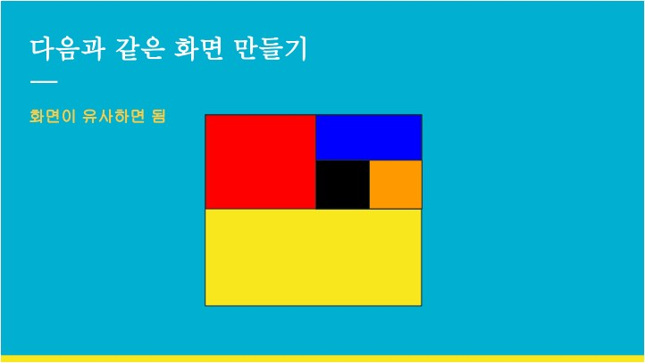
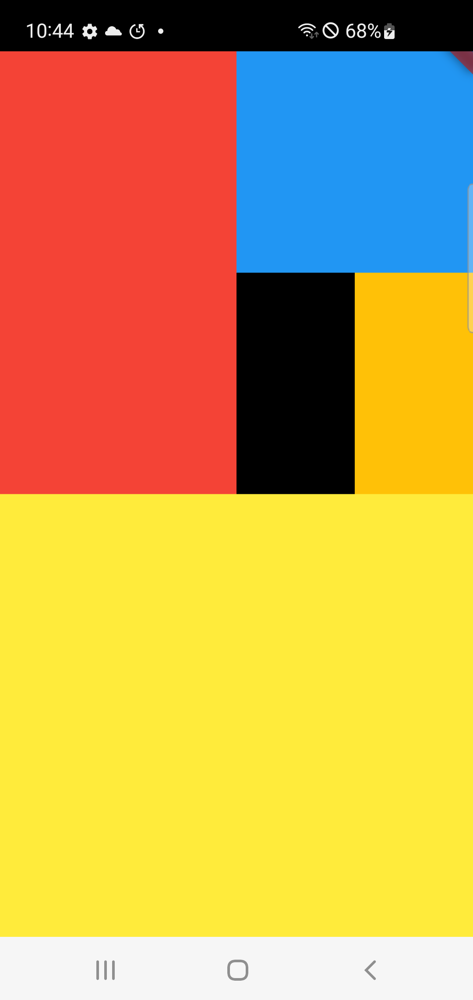

# 화면배치 과제1
## 강의자료

## 내 화면

 
```Dart
import 'package:flutter/material.dart';
import 'package:flutter/services.dart';

void main() {
  SystemChrome.setSystemUIOverlayStyle(
    const SystemUiOverlayStyle(
      statusBarColor: Colors.black,
      statusBarIconBrightness: Brightness.light,
    ),
  );
  runApp(const MyApp());
}


class MyApp extends StatelessWidget {
  const MyApp({super.key});

  @override
  Widget build(BuildContext context) {
    return MaterialApp(
      home: Scaffold(
        body: SafeArea(
          child: Column(
            children: [
              Expanded(
                flex: 1,
                child: Row(
                  children: [
                    Expanded(
                      flex: 1,
                      child: Container(
                        color: Colors.red,
                      ),
                    ),
                    Expanded(
                      flex: 1,
                      child: Column(
                        children: [
                          Expanded(
                            child: Container(color: Colors.blue),
                          ),
                          Expanded(
                            flex: 1,
                            child: Row(
                              children: [
                                Expanded(
                                  child: Container(color: Colors.black),
                                ),
                                Expanded(
                                  child: Container(color: Colors.amber),
                                ),
                              ],
                            ),
                          ),
                        ],
                      ),
                    ),
                  ],
                ),
              ),
              Expanded(
                flex: 1,
                child: Container(
                  color: Colors.yellow,
                ),
              ),
            ],
          ),
        ),
      ),
    );
  }
}
```