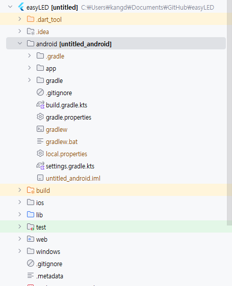

# 프로젝트의 이름 바꾸는 법
레파지토리를 먼저 만들고 프로젝트를 생성하려다 보니 자꾸 충돌이 일어났다.<br>
그래서 해결한 방법이
1. 레파지토리를 클론한다.
2. 임시 디렉토리에 프로젝트를 생성한다.
3. 복붙해서 easyLED 디렉토리에 옮긴다.
<br>그냥 옮기고 프로젝트 열었더니 easyLED로 열리길래 이름 바뀐지 알았는데 __아니였다!!__

### 프로젝트 이름을 바꾸는 법
✅ 1. `pubspec.yaml` 수정

`pubspec.yaml` 파일의 상단에서 `name:` 항목을 새로운 프로젝트 이름으로 수정합니다.

```yaml
name: easy_led
```
✅ 2. Android 관련 파일 수정
android/app/src/main/AndroidManifest.xml 파일을 열고 아래와 같이 android:label 값을 수정합니다.
```xml
<application
    android:label="easyLED"
    ... >
</application>

```
✅ 3. iOS 관련 파일 수정
ios/Runner.xcodeproj/project.pbxproj 파일을 열고 "untitled" 또는 "Untitled" 문자열을 검색하여 원하는 이름으로 모두 바꿔줍니다.
```ini
PRODUCT_NAME = easyLED;
```
✅ 4. 프로젝트 디렉토리 이름 변경 (선택)
파일 탐색기에서 프로젝트 루트 디렉토리의 이름을 untitled에서 easyLED 등 원하는 이름으로 바꿔줍니다.

✅ 5. 캐시 제거 및 의존성 재설치
터미널을 열고 아래 명령어를 차례대로 실행합니다.

```bash
flutter clean
flutter pub get
```
✅ 6. IDE 재시작
Android Studio 또는 VS Code를 재시작하면 이름 변경이 정상적으로 반영됩니다.


## 하지만 이것도 귀찮은 나였다.  Flutter 프로젝트 이름 한 번에 바꾸는 방법
✅ 1. 패키지 설치
터미널을 열고 프로젝트 루트에서 아래 명령어 실행:
```bash
flutter pub add rename
```
또는 수동으로 pubspec.yaml에 추가:

```yaml
dev_dependencies:
  rename: ^2.1.1
```
(버전은 최신 걸로 자동 적용돼)


✅ 2. 명령어로 이름 바꾸기
터미널에서 아래 명령어 입력 (예: easy_led로 바꾸고 싶을 때):

```bash
flutter pub run rename --appname "easyLED"
flutter pub run rename --bundleId com.yourcompany.easyled
```
🔁 옵션 설명:
--appname : 앱 표시 이름 (기기에서 보이는 이름)

--bundleId : 패키지 이름 (com.example.untitled → com.yourcompany.easyled)

✅ 3. 변경 사항 확인
Android: AndroidManifest.xml, build.gradle, MainActivity.kt

iOS: Info.plist, project.pbxproj

✅ 4. 빌드 클린 및 재실행
```bash
flutter clean
flutter pub get
```
✅ 보너스: 패키지 이름과 앱 이름 같이 바꾸기
한 줄로도 가능:
```bash
flutter pub run rename --appname "easyLED" --bundleId com.yourcompany.easyled
```
❗주의사항
프로젝트 디렉토리 자체 이름(untitled)은 직접 변경해야 함 (파일 탐색기에서)

GitHub 경로 등도 함께 바꾸려면 수동 조정 필요
# 근데 패키지 업데이트(3.xx) 버전 이후라 이것도 안돼 밑에 코드로 ㄱㄱ
```bash
# 앱 이름 변경
dart run rename setAppName --value easyLED --targets android,ios

# 번들 ID 변경
dart run rename setBundleId --value com.kangd.easyled --targets android,ios

# pubspec.yaml은 수동으로 name 수정
# 예: name: easy_led

# 캐시 정리 후 재설치
flutter clean
flutter pub get
```

<br>


