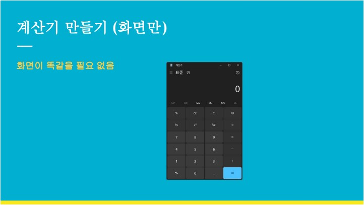
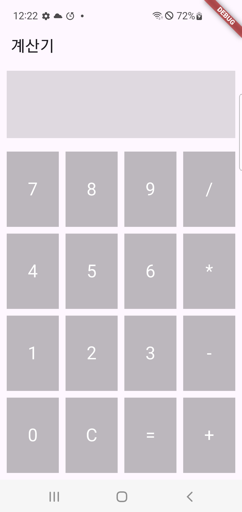

# 화면배치 과제2

## 강의자료



## 내 화면


 
```Dart
import 'package:flutter/material.dart';

void main() {
runApp(const MyApp());
}

class MyApp extends StatelessWidget {
const MyApp({super.key});

@override
Widget build(BuildContext context) {
return MaterialApp(
home: Scaffold(
appBar: AppBar(title: Text('계산기')),
body: Column(
children: <Widget>[
// 디스플레이 영역
Padding(
padding: EdgeInsets.all(10),
child: SizedBox(
height: 100,
child: Container(color: Colors.black12),
),
),
// 버튼 영역
Expanded(
child: Padding(
padding: EdgeInsets.fromLTRB(5, 5, 5, 5),
child: Column(
children: [
Expanded(
child: Row(
children: [
Expanded(
child: Padding(
padding: EdgeInsets.all(5),
child: Container(
color: Colors.black26,
alignment: Alignment.center,
child: Text('7', style: TextStyle(fontSize: 24, color: Colors.white)),
),
),
),
Expanded(
child: Padding(
padding: EdgeInsets.all(5),
child: Container(
color: Colors.black26,
alignment: Alignment.center,
child: Text('8', style: TextStyle(fontSize: 24, color: Colors.white)),
),
),
),
Expanded(
child: Padding(
padding: EdgeInsets.all(5),
child: Container(
color: Colors.black26,
alignment: Alignment.center,
child: Text('9', style: TextStyle(fontSize: 24, color: Colors.white)),
),
),
),
Expanded(
child: Padding(
padding: EdgeInsets.all(5),
child: Container(
color: Colors.black26,
alignment: Alignment.center,
child: Text('/', style: TextStyle(fontSize: 24, color: Colors.white)),
),
),
),
],
),
),
Expanded(
child: Row(
children: [
Expanded(
child: Padding(
padding: EdgeInsets.all(5),
child: Container(
color: Colors.black26,
alignment: Alignment.center,
child: Text('4', style: TextStyle(fontSize: 24, color: Colors.white)),
),
),
),
Expanded(
child: Padding(
padding: EdgeInsets.all(5),
child: Container(
color: Colors.black26,
alignment: Alignment.center,
child: Text('5', style: TextStyle(fontSize: 24, color: Colors.white)),
),
),
),
Expanded(
child: Padding(
padding: EdgeInsets.all(5),
child: Container(
color: Colors.black26,
alignment: Alignment.center,
child: Text('6', style: TextStyle(fontSize: 24, color: Colors.white)),
),
),
),
Expanded(
child: Padding(
padding: EdgeInsets.all(5),
child: Container(
color: Colors.black26,
alignment: Alignment.center,
child: Text('*', style: TextStyle(fontSize: 24, color: Colors.white)),
),
),
),
],
),
),
Expanded(
child: Row(
children: [
Expanded(
child: Padding(
padding: EdgeInsets.all(5),
child: Container(
color: Colors.black26,
alignment: Alignment.center,
child: Text('1', style: TextStyle(fontSize: 24, color: Colors.white)),
),
),
),
Expanded(
child: Padding(
padding: EdgeInsets.all(5),
child: Container(
color: Colors.black26,
alignment: Alignment.center,
child: Text('2', style: TextStyle(fontSize: 24, color: Colors.white)),
),
),
),
Expanded(
child: Padding(
padding: EdgeInsets.all(5),
child: Container(
color: Colors.black26,
alignment: Alignment.center,
child: Text('3', style: TextStyle(fontSize: 24, color: Colors.white)),
),
),
),
Expanded(
child: Padding(
padding: EdgeInsets.all(5),
child: Container(
color: Colors.black26,
alignment: Alignment.center,
child: Text('-', style: TextStyle(fontSize: 24, color: Colors.white)),
),
),
),
],
),
),
Expanded(
child: Row(
children: [
Expanded(
child: Padding(
padding: EdgeInsets.all(5),
child: Container(
color: Colors.black26,
alignment: Alignment.center,
child: Text('0', style: TextStyle(fontSize: 24, color: Colors.white)),
),
),
),
Expanded(
child: Padding(
padding: EdgeInsets.all(5),
child: Container(
color: Colors.black26,
alignment: Alignment.center,
child: Text('C', style: TextStyle(fontSize: 24, color: Colors.white)),
),
),
),
Expanded(
child: Padding(
padding: EdgeInsets.all(5),
child: Container(
color: Colors.black26,
alignment: Alignment.center,
child: Text('=', style: TextStyle(fontSize: 24, color: Colors.white)),
),
),
),
Expanded(
child: Padding(
padding: EdgeInsets.all(5),
child: Container(
color: Colors.black26,
alignment: Alignment.center,
child: Text('+', style: TextStyle(fontSize: 24, color: Colors.white)),
),
),
),
],
),
),
],
),
),
),
],
),
),
);
}
}

```

```
