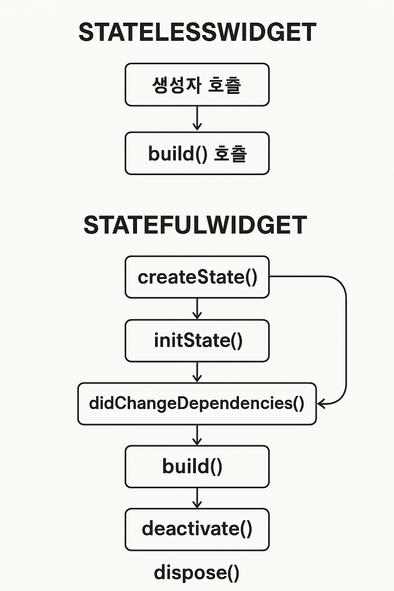
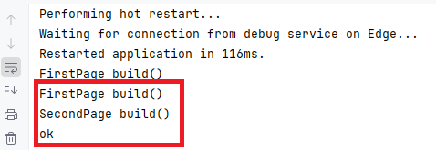
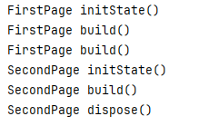

# 앱프로그래밍응용 6주차과제  
1. 위젯의 라이프 사이클 확인
2. Stack구조와 push(), pop()출력

## 페이지 이동간의 push, pop의 형태로 이동되는 stack구조와 생명주기
### 생명주기란?
생명주기(Lifecycle):  위젯이 생성되고, 업데이트되고, 제거되기까지의 흐름   
각 위젯마다 이 흐름이 다르기 때문에, 개발자가 어떤 시점에서 어떤 작업을 해야 할지 이해하는 데 꼭 필 요

---

### 1-1 . StatelessWidget (정적 위젯)의 생명주기
#### StatelessWidget(정적 위젯)의 build() 동작
- StatelessWidget은 상태가 변하지 않는 위젯
- 즉, 한 번 만들어지면 바뀌지 않음.    
- 생명주기 단계도 아주 단순

#### 생명주기 흐름
```
생성자 호출 → build() 호출
```
생성자: 위젯이 처음 생성될 때 실행   
build(): 화면에 그릴 UI를 반환하는 함수   
상태가 바뀌지 않으니까, 다시 build되려면 전체 위젯 트리가 다시 그려질 때 뿐

```dart
import 'package:flutter/material.dart';

void main() {
  runApp(const MyApp());
}

class MyApp extends StatelessWidget {
  const MyApp({super.key});

  @override
  Widget build(BuildContext context) {
    return MaterialApp(
      title: 'Flutter Demo',
      theme: ThemeData(
        colorScheme: ColorScheme.fromSeed(seedColor: Colors.blue),
        useMaterial3: true,
      ),
      home: FirstPage(), //기본(처음) 홈은 firstpage
    );
  }
}

//같은 lib 디렉토리에 firstpage/ secondpage 작성 후 import해도 ㄱㅊ
class FirstPage extends StatelessWidget{//첫번째페이지
  @override
  Widget build(BuildContext context){
    print('FirstPage build()');
    return Scaffold(
      appBar: AppBar(
        title:Text('FirstPage'),
      ),
      body: ElevatedButton(
        child: Text('다음페이지로'),
        onPressed: () {
          Navigator.push(
            context,
            MaterialPageRoute(builder: (context) => SecondPage()),
          );
        },
      ),
    );
  }
}

class SecondPage extends StatelessWidget{//두번째페이지
  @override
  Widget build(BuildContext context) {
    print('SecondPage build()');
    return Scaffold(
      appBar: AppBar(
        title: Text('Second'),
      ),
      body: ElevatedButton(
        child: Text('이전페이지로'),
        onPressed: () {
          Navigator.pop(context);
          print('ok');
        },
      ),
    );
  }
}
```



### 1-2 . StatefulWidget (동적 위젯)의 생명주기
> init(), build(), dispose()

- StatefulWidget은 상태를 가진다
- 내부 상태에 따라 UI가 바뀌는 위젯
- 더 복잡한 생명주기

#### 주요 생명주기 메서드
```
1. createState()
2. initState()
3. didChangeDependencies()
4. build()
5. setState()
6. deactivate()
7. dispose()
```
#### 단계별 설명
|메서드	|설명|
|---|---|
createState() |	위젯 생성 시, 연결된 상태(State)를 생성
__initState()__|	위젯이 처음 생성될 때 한 번만 호출됨 (초기화 작업에 사용)
didChangeDependencies() |	상위 위젯에서 전달받은 데이터가 바뀔 때 호출됨 (context 관련 초기화)
__build()__ |	위젯을 화면에 그리는 함수 (상태가 바뀌면 이게 다시 호출됨)
setState() |	상태가 바뀌었음을 Flutter에게 알려서 build()를 다시 호출하게 함
deactivate() |	위젯이 위젯 트리에서 제거될 때 호출됨 (하지만 아직 완전히 제거되진 않음)
__dispose()__ |	위젯이 완전히 제거될 때 호출됨 (리소스 해제 작업 필요 시 사용)

```dart
import 'package:flutter/material.dart';

void main() {
  runApp(const MyApp());
}

class MyApp extends StatelessWidget {
  const MyApp({super.key});

  @override
  Widget build(BuildContext context) {
    return MaterialApp(
      title: 'Flutter Demo',
      theme: ThemeData(
        colorScheme: ColorScheme.fromSeed(seedColor: Colors.pinkAccent),
        useMaterial3: true,
      ),
      home: FirstStatefulPage(),
    );
  }
}

class Person {
  String name;
  int age;

  Person(this.name, this.age);
}

// First Page (Stateful)
class FirstStatefulPage extends StatefulWidget {
  @override
  _FirstStatefulPageState createState() => _FirstStatefulPageState();
}

class _FirstStatefulPageState extends State<FirstStatefulPage> {
  @override
  void initState() { //init
    super.initState();
    print('FirstPage initState()');
  }

  @override
  void dispose() {//dispose
    super.dispose();
    print('FirstPage dispose()');
  }

  @override
  Widget build(BuildContext context) {
    print('FirstPage build()');
    return Scaffold(
      appBar: AppBar(
        title: Text('First'),
      ),
      body: ElevatedButton(
        child: Text('다음 페이지로'),
        onPressed: () {
          final person = Person('홍길동', 20);
          Navigator.push(
            context,
            MaterialPageRoute(
              builder: (context) => SecondStatefulPage(person: person),
            ),
          );
        },
      ),
    );
  }
}

// Second Page (Stateful)
class SecondStatefulPage extends StatefulWidget {
  final Person person;
   
  const SecondStatefulPage({Key? key, required this.person}) : super(key: key);

  @override
  _SecondStatefulPageState createState() => _SecondStatefulPageState();
}

class _SecondStatefulPageState extends State<SecondStatefulPage> {

  @override
  void initState() { //init
    super.initState();
    print('SecondPage initState()');
  }

  @override
  void dispose() {//dispose
    super.dispose();
    print('SecondPage dispose()');
  }

  @override
  Widget build(BuildContext context) {
    print('SecondPage build()');
    return Scaffold(
      appBar: AppBar(
        title: Text(widget.person.name),
      ),
      body: ElevatedButton(
        child: Text('이전 페이지로'),
        onPressed: () {
          Navigator.pop(context);
        },
      ),
    );
  }
}
```

---
