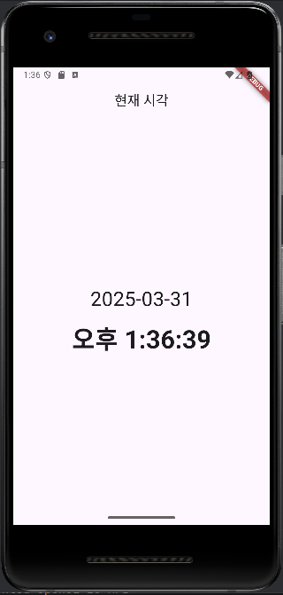

# 안드로이드 과제 
어려워 ㅜㅜ
실행화면<br>


```dart
import 'package:flutter/material.dart';
import 'dart:async'; // Timer 쓰려면 필요
import 'package:intl/intl.dart'; // 시간 포맷 위해 필요

void main() {
  runApp(const MyApp());
}

class MyApp extends StatelessWidget {
  const MyApp({super.key});

  // This widget is the root of your application.
  @override
  Widget build(BuildContext context) {
    return MaterialApp(
      title: '현재 시각',
      theme: ThemeData(
        primarySwatch: Colors.blue,
      ),
      home: TimePage(),
    );
  }
}

class TimePage extends StatefulWidget {
  @override
  _TimePageState createState() => _TimePageState();
}

class _TimePageState extends State<TimePage> {
  late String _date;
  late String _time;
  late Timer _timer;

  @override
  void initState() {
    super.initState();
    _updateTime(); // 처음 화면에 시간 보여주기
    _timer = Timer.periodic(Duration(seconds: 1), (Timer t) => _updateTime()); // 1초마다 갱신
  }

  void _updateTime() {
    final now = DateTime.now();
    final formatterDate = DateFormat('yyyy-MM-dd');
    final formatterTime = DateFormat('a h:mm:ss', 'ko'); // 'a'는 오전/오후, 'ko'로 한국어 설정

    setState(() {
      _date = formatterDate.format(now);
      _time = formatterTime.format(now);
    });
  }

  @override
  void dispose() {
    _timer.cancel(); // 타이머 해제
    super.dispose();
  }

  @override
  Widget build(BuildContext context) {
    return Scaffold(
      appBar: AppBar(
        title: Text('현재 시각'),
        centerTitle: true,
      ),
      body: Center(
        child: Column(
          mainAxisAlignment: MainAxisAlignment.center,
          children: [
            Text(
              _date,
              style: TextStyle(fontSize: 32),
            ),
            SizedBox(height: 10),
            Text(
              _time,
              style: TextStyle(fontSize: 40, fontWeight: FontWeight.bold),
            ),
          ],
        ),
      ),
    );
  }
}
```