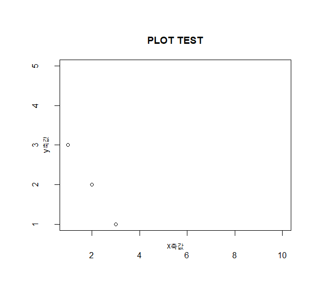
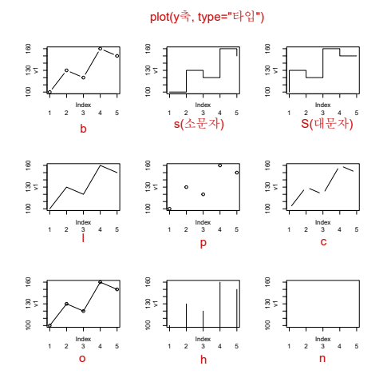

##### 0507
| 패키지명          | 주요 기능 요약                                                                                             |
| ------------- | ---------------------------------------------------------------------------------------------------- |
| **lubridate** | 날짜 및 시간 데이터를 간편하게 처리하고 조작할 수 있게 해주는 패키지→ `ymd()`, `wday()`, `hour()` 등 함수로 날짜 파싱 및 연산이 쉬움            |
| **dplyr**     | 데이터 전처리를 효율적으로 할 수 있는 문법 제공→ `filter()`, `select()`, `mutate()`, `group_by()`, `summarise()` 등이 핵심   |
| **ggplot2**   | 다양한 그래프와 시각화를 만들 수 있는 강력한 시각화 도구→ `ggplot() + geom_...()` 형식으로 레이어 쌓듯이 그리기                           |
| **googleVis** | 구글 차트를 R에서 사용할 수 있도록 해주는 패키지→ `gvisLineChart()`, `gvisGeoChart()` 등 HTML 인터랙티브 시각화                   |
| **plyr**      | 데이터를 그룹별로 처리하거나 요약할 때 사용하는 도구→ `ddply()`, `ldply()` 등 다양한 자료구조 처리에 사용됨 (하지만 **dplyr**에 밀려 현재는 잘 안 씀) |

## 그래픽 기본
### plot() : 분포도/ 꺽은선그래프
- R의 기본 그래픽 함수
```r
plot(y축데이터, 옵션들)
```


<figure>
    
</figure>

```r
plot(x,y,xlim = c(1,10), ylim=c(1,5), xlab="x축값", ylab="y축값", main="PLOT TEST")
```
- 축의 한계값 지정: xlim, ylim
- 축 제목: xlab, ylab
- 그래프 제목: main
```r
plot(v1,type='o',col='red',ylim = c(0,200),axes = F,ann = F) # 그래프만 생성

axis(1, at=1:5, lab=c('MON','TUE','WED','THU','FRI')) # x축 생성 
axis(2, ylim=c(0,200)) # y축 생성
title(main='FRUITS',col.main='red',font.main=4) # 그래프 제목
title(xlab='DAY',col.lab='black') # x축 제목
title(ylab = 'PRICE',col.lab='blue') # y축 제목
```
- **`axes=F`** : 축(눈금포함) 자동 없음,
- **`ann=F`** : 제목 자동 없음  
    → 대신 `axis()`, `title()`로 직접 추가!

그래프 옵션 :
<figure>
    
</figure>

|   plot(v1, type = 'b') <br>점과 선    |     plot(v1, type='s') <br>왼쪽 시작 계단형     |   plot(v1, type='S')<br>오른쪽 시작 계단형   |
| :--------------------------------: | :--------------------------------------: | :----------------------------------: |
|    **plot(v1, type='l')<br>선**     |       **plot(v1, type='p')<br>점**        | **plot(v1, type='c')<br>'b'에서 점 생략** |
| **plot(v1, type='o')<br>점과 선이 중첩** | **plot(v1, type='h')<br>각 점에서 x축까지 수직선** |   **plot(v1, type='n')<br>축만 표현**    |

#### par()함수
- **그래프의 배치 조정: mfrow**
```r
par(mfrow=c(nr,nc)) # row의 개수, col의 개수
```
- **그래프의 여백 조정(축 내부): mpg**
```r
par(mgp=c(제목위치, 지표값위치, 지표선 위치))
par(mgp=c(1,2,0))
```
- **그래프의 전체 여백 조정(바깥 영역): oma**
```r
par(oma(bottom, left, top, right))
par(oma=c(2,2,2,2))
```
- **여러 개의 그래프를 중첩으로 그리기**
1. **par(new=T)**
```r
plot(v1, type='s', col='red',ylim=c(1,5))
par(new=T)
plot(v2, type='o', col='blue', ylim = c(1,5))
par(new=T)
plot(v3, type='l', col='green')
```
2. **lines()**
```r
plot(v1, type='s',col='red', ylim = c(1,10)) 
# ylim: 전체 값(v1~3)의 y값을 포용할 수 있는 값으로 (1~7이상)
lines(v2, type='o', col='blue',ylim=c(1,5))
lines(v3, type='l', col='green', ylim=c(1,100))
```
#### 범례 추가
```r
legend(x축, y축, 내용, cex = 글자크기, col=색상, pch=크기, lty=선 모양)
legend(4,9,c('v1','v2','v3'), cex=0.9, col=c('red','blue','green'),lty=1)
```
- fill=rainbow(nrow(qty)))
### barplot() : 막대 그래프
- 기본 세로 막대그래프
- 기본으로 하나의 막대에 합쳐서 출력
- height 값은 필수
```r
barplot(x, beside=T, names=c(5,3), col=c('green','yellow'), horiz=T)
```
- 가로 막대형: horiz=T
- 그룹으로 묶어서 출력: beside=T
```r
barplot(x, names=c(5,3), col=c('green','yellow'), horiz=T, xlim = c(0,12))
```
- 하나의 막대로 가로 출력: beside를 안쓰면 됨

```r
barplot(as.matrix(qty), main='FRUITS SALES', beside=T, col=rainbow(nrow(qty)),ylim = c(0,400))
legend(14,400,c('MON','TUE','WED','THU','FRI'),cex= 0.8, fill=rainbow(nrow(qty))) 
#행:요일 , 열:과일
```
여러 막대를 그룹으로 묶어 한꺼번에 출력
	그룹으로 묶어 출력 시 반드시 matrix여야 한다.
	
- **전치 행렬: 행/열 뒤바뀜 : t(행렬)**
```r
t(qty)  #행:과일, 열: 요일
barplot(t(qty),main = 'FRUITS SALES',col=rainbow(length(qty)),ylim=c(0,400),
names.arg=c('MON','TUE','WED','THU','FRI'),cex.axis=0.8, las=1, cex=0.8,beside=T) 
#las(축 라벨 글자방향) 값이 1이면 x축 값이 가로 2 면 세로다.
```
### 조건을 주고 그래프 그리기
peach 값이 200 이상 red, 180~199 yellow, 그 이하 green
```r
colors=c()
for(i in 1:length(peach)){
  if(peach[i]>=200){
    colors=c(colors, 'red') #기존벡터=C(기존벡터, "업데이트값")
  } else if (peach[i]>=180){
    colors=c(colors,'yellow')
  }else{
    colors=c(colors, 'green')
  }
}

```

```r
barplot(peach, main='PEACH SALES', names.arg=c('MON','TUE','WED','THU','FRI'),col=colors)
```
### 매개 변수가 있는 함수 처리
```r
f1=function(f){
  colors=NULL
  for(i in 1:length(f)){
    if(f[i]>=200){
      colors[i]='blue'
    } else if (f[i]>=180){
      colors[i]='pink'
    }else{
      colors[i]='green'
    }
  }
  return(colors)
}

f1(peach)
```

```r
barplot(peach, col = f1(peach),names.arg = c('MON','TUE','WED','THU','FRI'))
```